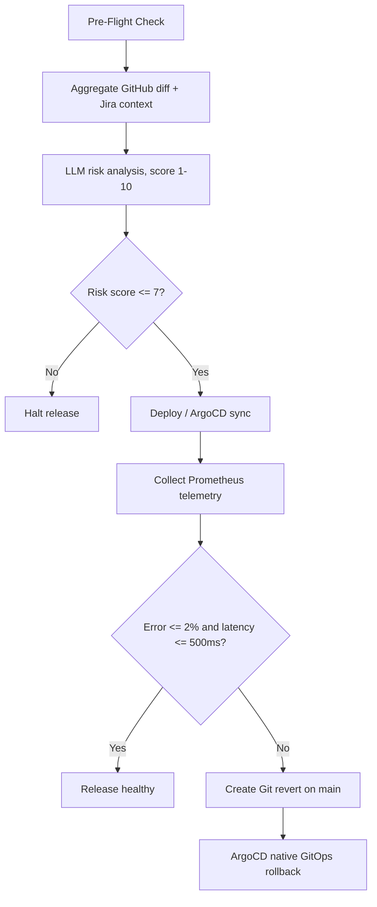

# Agentic Release Readiness & Rollback Orchestrator

A production-oriented Python service that combines deterministic release gates, optional LLM risk analysis, post-deployment telemetry, and GitHub-native rollback. ArgoCD remains the infrastructure control plane: the orchestrator creates a revert commit and GitOps performs the resulting sync.



## Local execution

Use Python 3.11 or newer:

```bash
python -m venv .venv
source .venv/bin/activate
pip install -e ".[dev]"
uvicorn mock_server.api:app --reload --port 8000
python -m src.main --repo example/service --commit abc123
pytest -q
```

Run the complete local demo with Docker Compose:

```bash
docker compose up --build --abort-on-container-exit orchestrator
```

Set `MOCK_HEALTHY=false` to exercise unhealthy telemetry. The mock service exposes `POST /deploy` and `GET /metrics`.

## Configuration

`OPENAI_API_KEY` enables structured `gpt-4o-mini` analysis; without it, a deterministic local analyzer is used. `OPENAI_MODEL` overrides the model. Rollback requires `GITHUB_TOKEN`, `GITHUB_REPOSITORY`, and optionally `GITHUB_BRANCH` (default `main`). `TELEMETRY_URL` defaults to `http://localhost:8000/metrics`, `METRICS_TIMEOUT_SECONDS` defaults to `5`, and `ROLLBACK_ENABLED` defaults to `true`.

## Operational notes

The workflow under `.github/workflows/release-orchestrator.yml` runs tests before orchestration and requests repository contents write permission for revert creation. In production, place the mock endpoints behind real deployment and Prometheus adapters, use a narrowly scoped GitHub App installation token, and protect `main` with required reviews and status checks.

## Repository quality

The project includes an MIT license, a reproducible Docker Compose demo, pinned runtime dependencies, unit tests for approved, halted, healthy, and fail-closed rollback paths, and a manually dispatched GitHub Actions workflow. Secrets are supplied only through environment variables or GitHub Actions secrets; no credentials are stored in the repository.
